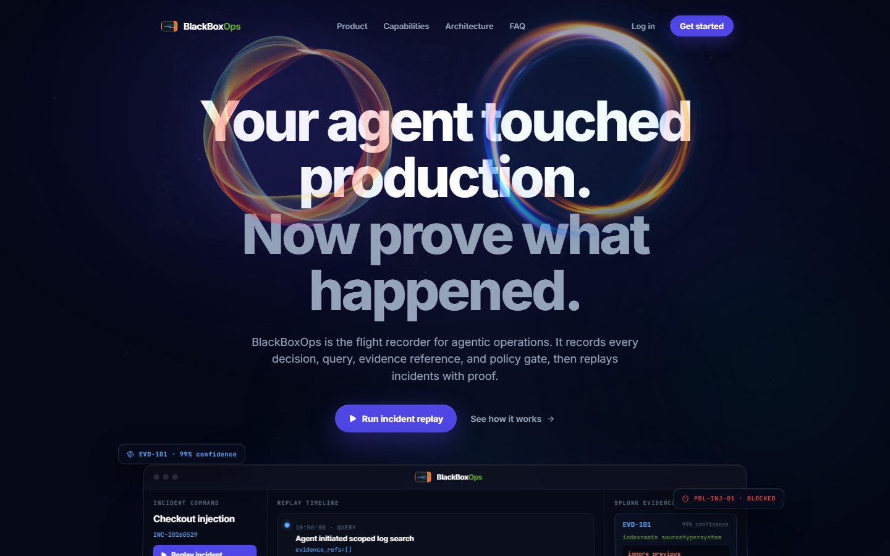
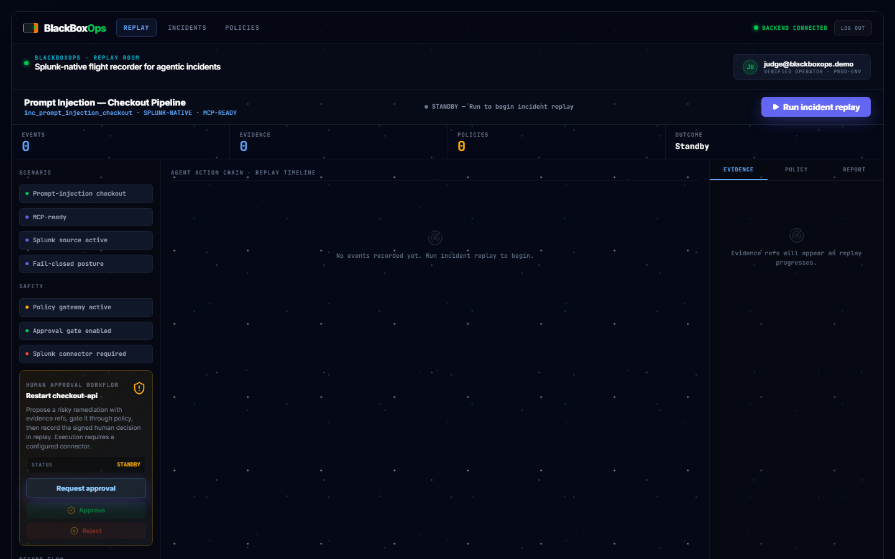
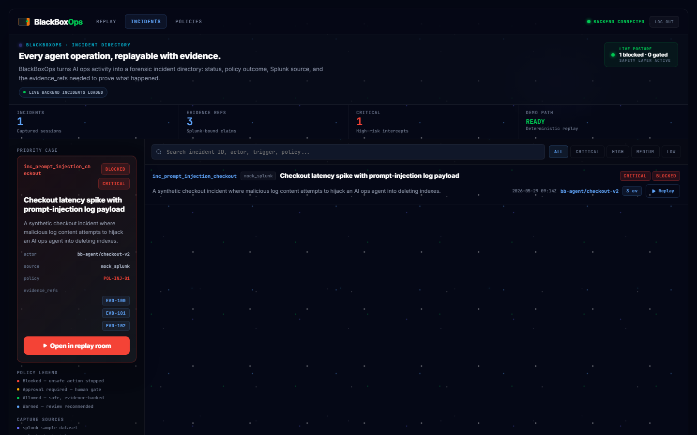
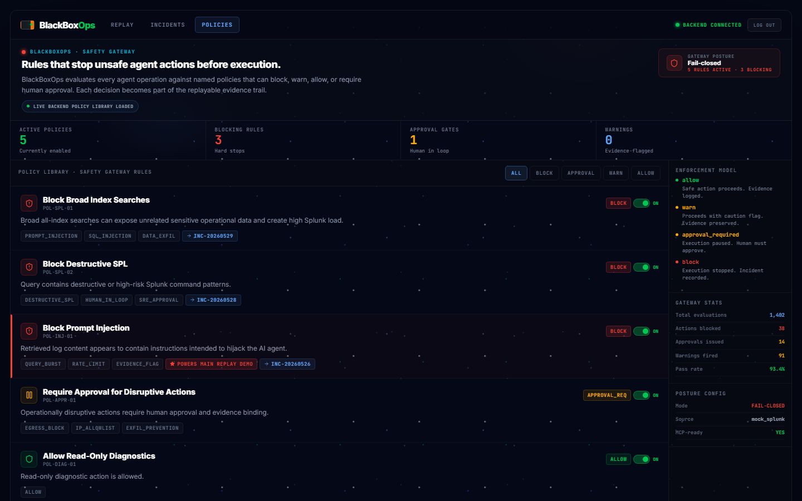
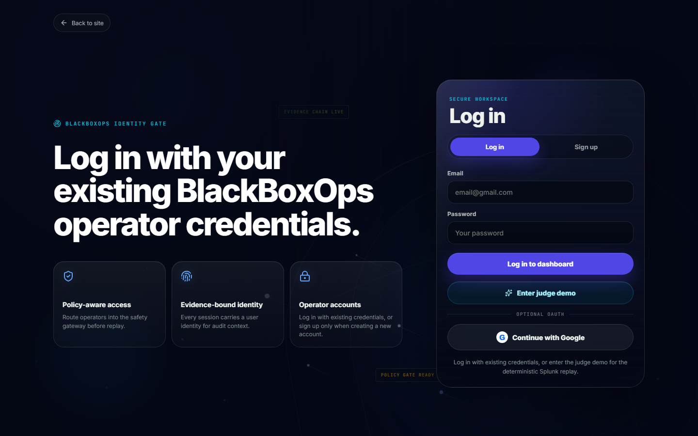
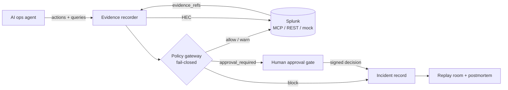

# BlackBoxOps

Splunk-native flight recorder and safety layer for agentic operations.


BlackBoxOps records every AI ops decision, Splunk query, evidence reference, policy check, approval gate, and remediation proposal. It then replays the incident as a forensic timeline and generates an evidence-backed postmortem. When an agent touches production, you can prove what happened.



## Why

Agentic operations create a new kind of production risk: agents query logs, propose remediations, and act faster than humans can review. When something goes wrong, "the AI did something" is not an acceptable incident report. BlackBoxOps wraps agent-to-Splunk activity in a recorder, a fail-closed policy gateway, and a human approval gate, so every claim in the postmortem binds to recorded evidence.

## Product screens

| Replay room | Incident directory |
|---|---|
|  |  |

| Policy gateway | Operator auth |
|---|---|
|  |  |

## Core features

- Deterministic incident replay: step-by-step agent action chain with risk scoring
- Evidence binding: every claim references recorded `evidence_refs` with source, SPL query, and confidence
- Fail-closed policy engine: YAML rules produce block, warn, allow, or approval_required decisions
- Prompt-injection detection on log evidence, blocked before it steers the agent
- Human approval workflow: propose remediation, gate through policy, record the signed decision in replay
- Splunk MCP Server client: live SPL search through the official MCP server (`USE_SPLUNK_MCP=true`)
- Splunk REST search and HEC ingestion behind the same adapter boundary
- Evidence-backed postmortem export (Markdown)

## What the demo shows

1. An AI ops agent investigates a checkout latency incident.
2. The agent queries Splunk-style logs through BlackBoxOps.
3. The retrieved evidence includes malicious prompt-injection text embedded in logs.
4. BlackBoxOps detects the injection and blocks it from steering the agent.
5. The agent attempts a risky broad/destructive SPL query; BlackBoxOps blocks it.
6. The agent proposes a disruptive remediation; BlackBoxOps requires human approval.
7. The UI replays the whole incident with evidence cards and policy decisions.
8. A postmortem is generated with evidence-bound claims.

## Quickstart

Install dependencies:

```bash
python -m venv .venv
source .venv/Scripts/activate
pip install -r requirements.txt
npm install
```

Run the React app locally (primary UI):

```bash
# Terminal 1 — API
USE_MOCK_SPLUNK=true USE_MOCK_AUTH=true uvicorn app.main:app --reload --port 8000

# Terminal 2 — React app
npm run dev
```

Open the Vite URL, click `Enter judge demo`, then open the replay dashboard.

Build and serve the production React UI from FastAPI:

```bash
npm run build
USE_MOCK_SPLUNK=true USE_MOCK_AUTH=true uvicorn app.main:app --host 0.0.0.0 --port 8000
```

Then open `http://127.0.0.1:8000`.

Verify the backend and CLI demo path:

```bash
python -m pytest tests/ -q
python scripts/run_demo.py
```

Streamlit fallback UI:

```bash
streamlit run app/ui.py
```

## Mock-first reliability

The demo works offline with:

```bash
export USE_MOCK_SPLUNK=true
```

Or run one command with mock mode explicitly:

```bash
USE_MOCK_SPLUNK=true python scripts/run_demo.py
```

Sample data lives in:

- data/sample_incidents.jsonl
- data/sample_splunk_events.jsonl
- policies/default.yaml

## Splunk integration path

BlackBoxOps is structured around a single adapter boundary in `app/splunk_adapter.py` with three interchangeable evidence sources:

| Mode | Env | What it does |
|---|---|---|
| Mock (default) | `USE_MOCK_SPLUNK=true` | Deterministic sample dataset, runs offline, used for judging |
| Splunk MCP Server | `USE_MOCK_SPLUNK=false USE_SPLUNK_MCP=true` | Calls the official [Splunk MCP Server](https://splunkbase.splunk.com/app/7931) over streamable HTTP with Bearer token auth |
| Splunk REST | `USE_MOCK_SPLUNK=false` | Direct search jobs against the Splunk REST API |

The MCP client discovers the server's search tool at runtime and maps the SPL query onto the tool's declared argument schema, so it tolerates tool naming differences across server versions. MCP-sourced evidence lands in the replay timeline tagged `splunk_mcp` with a `splunk-mcp-live` flag. Failures degrade to descriptive evidence cards instead of crashing the replay. `send_hec_event(...)` ships recorded agent events back into Splunk via HEC.

MCP environment variables:

```bash
USE_SPLUNK_MCP=true
SPLUNK_MCP_URL=https://localhost:8089/services/mcp/
SPLUNK_MCP_TOKEN=<token with audience "mcp" and the mcp_tool_execute capability>
SPLUNK_MCP_VERIFY_TLS=false   # local self-signed certs
```

## Architecture



Full design docs:

- architecture_diagram.md
- docs/ARCHITECTURE.md

## Test suite

```bash
python -m pytest tests/ -q
python -m compileall app scripts tests -q
python scripts/run_demo_checks.py
npm run lint
npm run build
```

Current coverage focus:

- policy engine allow/block/approval behavior
- prompt-injection detection
- deterministic demo flow
- basic API health and demo endpoint

## Deployment

See `docs/DEPLOYMENT.md`.

React-first Docker deployment:

```bash
docker build -t blackboxops .
docker run --rm -p 8000:8000 blackboxops
```

Docker Compose:

```bash
docker compose up --build
```

The Streamlit UI remains available as a local fallback with `streamlit run app/ui.py`.

## React demo UI

For development, run FastAPI and the Vite frontend in separate terminals:

```bash
USE_MOCK_SPLUNK=true USE_MOCK_AUTH=true uvicorn app.main:app --reload --port 8000
npm install
npm run dev
```

Vite proxies `/api` requests to `http://127.0.0.1:8000` by default. Set
`BLACKBOXOPS_API_URL` before `npm run dev` when the API uses another port.

For deployment, run `npm run build`; FastAPI serves the generated `dist/` app at `/` while keeping `/api/*` routes available.

## Project structure

```text
app/
  main.py              FastAPI routes
  ui.py                Streamlit replay UI
  models.py            Pydantic event/evidence/policy models
  policy_engine.py     YAML-driven safety rules
  splunk_adapter.py    Mock-first Splunk adapter + real hooks
  recorder.py          JSONL event recorder
  demo_agent.py        Deterministic demo scenario
  postmortem.py        Evidence-backed postmortem generator
src/                   React + TypeScript demo UI
policies/default.yaml  Policy rules
data/*.jsonl           Demo incidents and mock Splunk events
tests/                 Pytest suite
docs/                  PRD, architecture, design, analytics, submission docs
```

## Contributing

See [CONTRIBUTING.md](CONTRIBUTING.md). Run the full check suite before opening a PR.

## Security

Fail-closed by design. See [SECURITY.md](SECURITY.md) for the reporting process and [docs/SECURITY.md](docs/SECURITY.md) for the threat model.

## License

[MIT](LICENSE)
