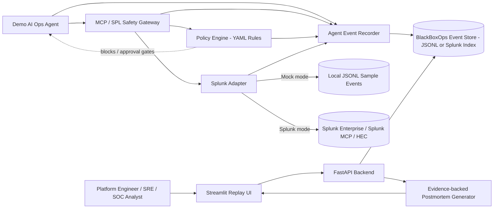

# BlackBoxOps Architecture Diagram

## Data Flow

1. Demo AI agent investigates an incident.
2. Agent queries Splunk through the safety gateway.
3. Gateway checks SPL scope, risky patterns, time range, and prompt-injection risks.
4. Splunk adapter returns evidence from mock JSONL or real Splunk.
5. Policy engine evaluates evidence and proposed remediation.
6. Recorder stores every prompt, query, evidence item, policy decision, and action proposal.
7. UI replays the full timeline and renders an evidence-backed postmortem.

## Why Splunk Matters

Splunk is the trusted operational evidence layer. BlackBoxOps does not only trace LLM calls; it ties agent decisions to logs, queries, events, policy outcomes, and remediation verification.
